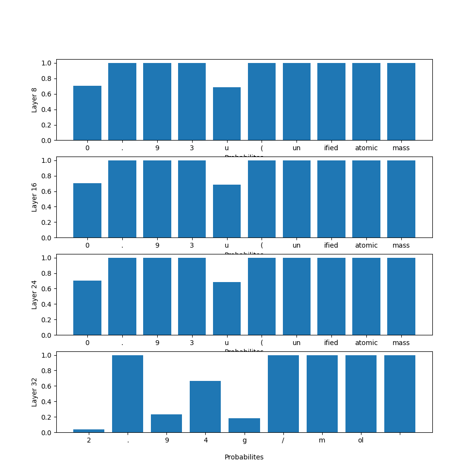
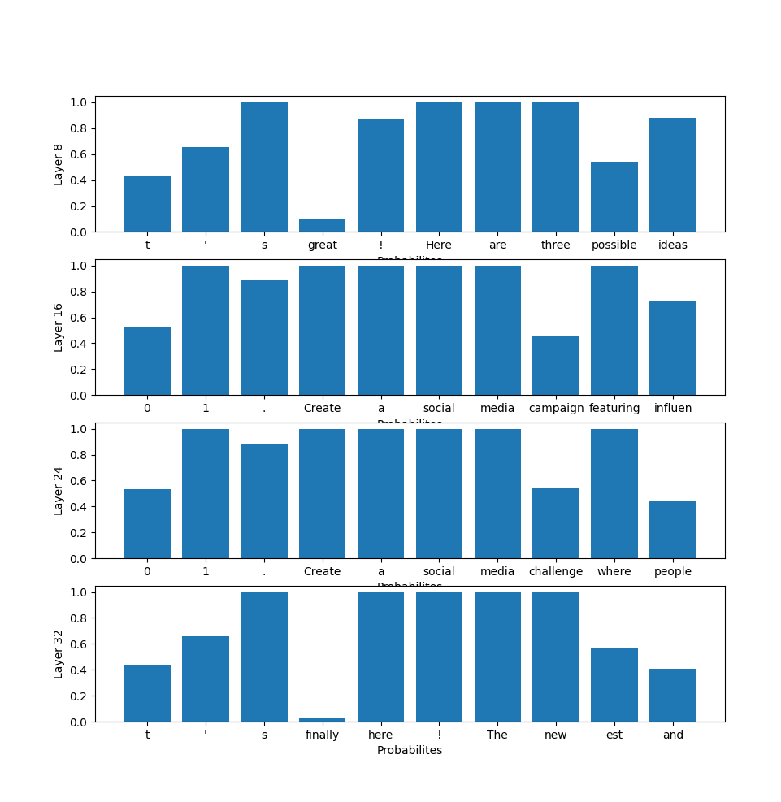
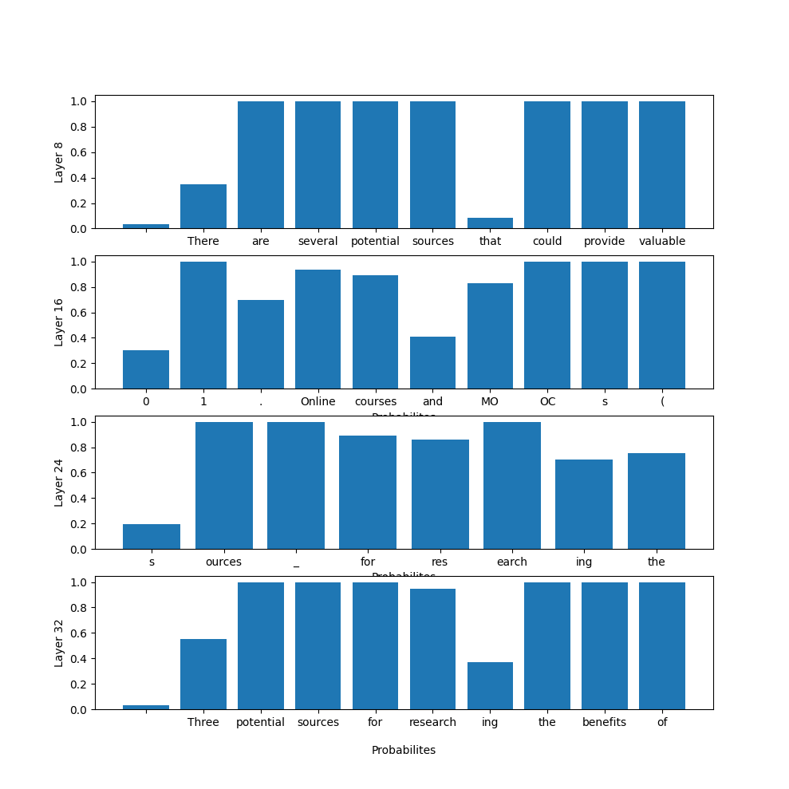

# Assignment2
Assignment2

This code evaluates the different layers of a model (Llama2) on the Standord Alpaca dataset. It then evaluates the models' BLEU, Rogue-L, and BERTScores.

#### Requirements
- Python 	3.11
- Pytorch 	 
- Transformer 	
- datasets
- evaluate
- trl
- peft
- tabulate
- statistics

### Datasets
- Download the Stanford Alpaca dataset at https://github.com/tatsu-lab/stanford_alpaca?tab=readme-ov-file#data-release

### Reproducibility
Run the code using python 3

### Task 1
Here are some graphs from the probabilities of generation for the llama2 model with different early exit layers.

Input: "Calculate the atomic mass for lithium."

Input: "Brainstorm 3 possible ideas to promote the following product: New motorized skateboard"

Input: "List three potential sources for the following research problem: What are the benefits of online learning?"

### Task 2
For this I just asked chatgpt from our assignment1a given context, which will be the answer given from the database, and ask if the generated output is correct. If it is, then add to a sum and divide by the number of questions at the end. Here are the results: 
| Layer    |     BLEU |
| -------- | -------- |
| Layer 8  | 0 |
| Layer 16 | 0 |
| Layer 24 | 0 |
| Layer 32 | 30% |

The results for this are pretty bad and Im sure its because I didnt train the LLM correctly.

### Task 3
Base Llama model
| Layer    |     BLEU |   Rogue-L |   BERTScore |
| -------- | -------- | --------- | ----------- |
| Layer 8  | 0.503511 |  0.478649 |    0.896649 |
| Layer 16 | 0.486005 |  0.427759 |    0.900098 |
| Layer 24 | 0.500413 |  0.528797 |    0.901518 |
| Layer 32 | 0.54229  |  0.575457 |    0.93543  |

Finetuned llama model
| Layer    |     BLEU |   Rogue-L |   BERTScore |
| -------- | -------- | --------- | ----------- |
| Layer 8  | 0.499891 |  0.541094 |    0.901434 |
| Layer 16 | 0.499891 |  0.566753 |    0.903337 |
| Layer 24 | 0.504036 |  0.470169 |    0.9104   |
| Layer 32 | 0.541496 |  0.579507 |    0.928604 |

Base phi model
| Layer    |     BLEU |   Rogue-L |   BERTScore |
| -------- | -------- | --------- | ----------- |
| Layer 8  | 0.502999 |  0.57747  |    0.908809 |
| Layer 16 | 0.505117 |  0.539834 |    0.910966 |
| Layer 24 | 0.513832 |  0.605707 |    0.922442 |
| Layer 32 | 0.566264 |  0.637146 |    0.942226 |

Finetuned phi model
| Layer    |     BLEU |   Rogue-L |   BERTScore |
| -------- | -------- | --------- | ----------- |
| Layer 8  | 0.501193 |  0.523765 |    0.899779 |
| Layer 16 | 0.499891 |  0.622141 |    0.908751 |
| Layer 24 | 0.500152 |  0.500343 |    0.900117 |
| Layer 32 | 0.500413 |  0.484696 |    0.895773 |

Base mistral model

| Layer    |     BLEU |   Rogue-L |   BERTScore |
| -------- | -------- | --------- | ----------- |
| Layer 16 | 0.402461 |  0.573299 |    0.904392 |
| Layer 24 | 0.500152 |  0.461964 |    0.910937 |
| Layer 32 | 0.515063 |  0.588803 |    0.907942 |

finetuned mistral model
| Layer    |     BLEU |   Rogue-L |   BERTScore |
| -------- | -------- | --------- | ----------- |
| Layer 8  | 0.499891 |  0.633909 |    0.910233 |
| Layer 16 | 0.500413 |  0.643794 |    0.915417 |
| Layer 24 | 0.499891 |  0.610646 |    0.904904 |
| Layer 32 | 0.500152 |  0.599136 |    0.905803 |

We can see from these tabels that obviously as the layers increase, so does their scores for each of the metrics. This is because as the layers increase, so does the avalible information from the neural network.

## References  
- https://huggingface.co/docs/transformers/en/training
- https://www.datacamp.com/tutorial/fine-tuning-llama-2
- https://huggingface.co/docs/peft/main/en/tutorial/peft_model_config
- https://github.com/brevdev/notebooks/blob/main/llama2-finetune-own-data.ipynb
